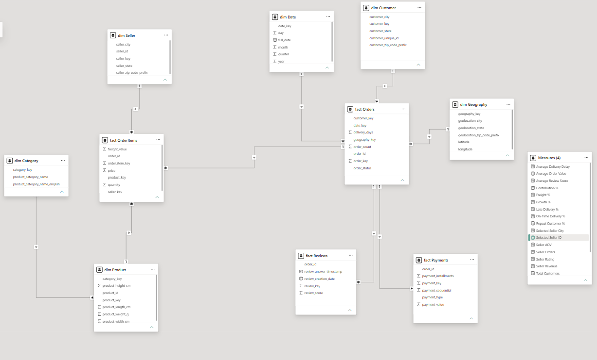
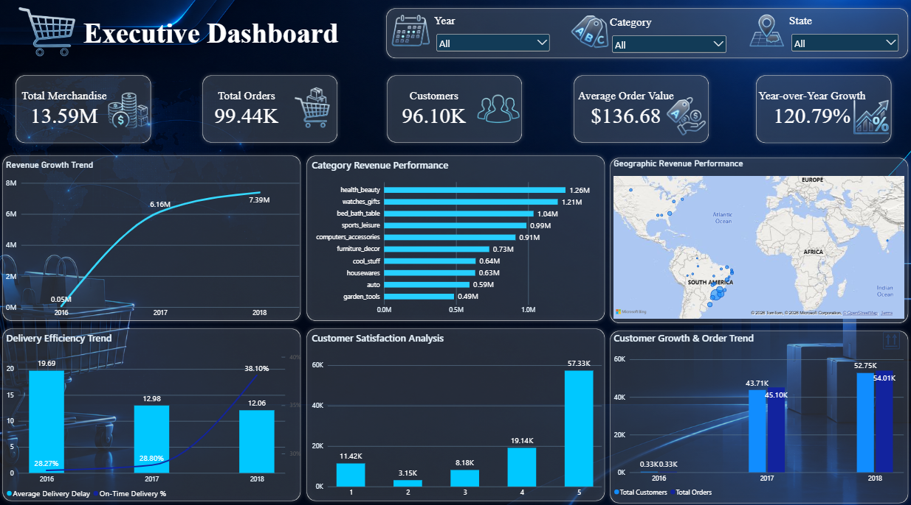
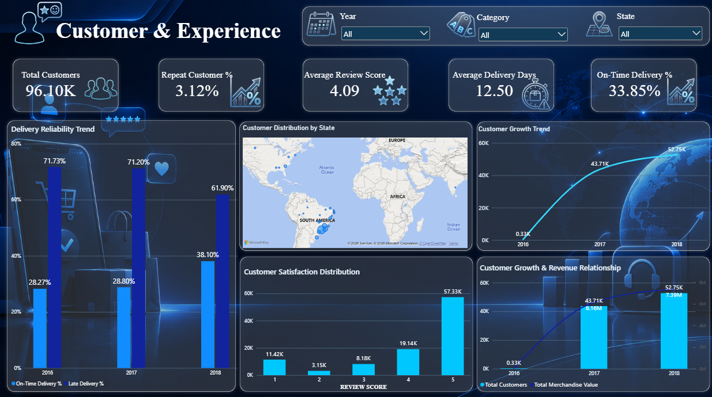
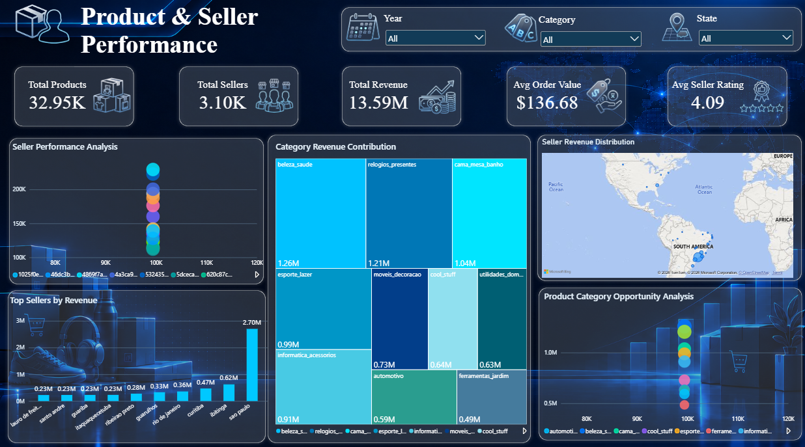
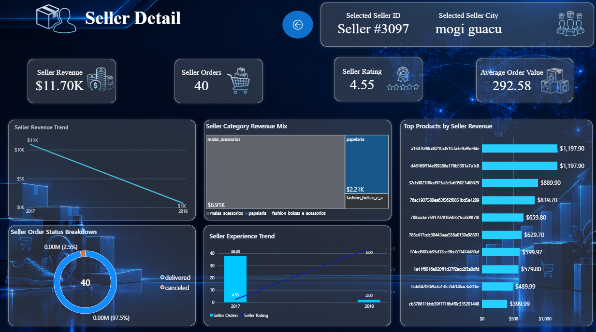

<div align="center">

# 🛒 Ecommerce Decision Intelligence Platform
### Olist E-Commerce Analytics Capstone

**An end-to-end analytics pipeline that turns raw marketplace data into decision-ready business intelligence.**


</div>

---

## 📌 Project Objective

This project builds an end-to-end **E-Commerce Decision Intelligence Platform** that transforms raw marketplace operational data into a reliable analytical solution for business decision-making.

The platform helps management understand:

| | | |
|---|---|---|
| 📈 Sales performance | 👥 Customer behaviour | 📦 Product performance |
| 🏪 Seller performance | 🚚 Delivery performance | ⭐ Customer satisfaction |
| 💳 Payment behaviour | 🚛 Freight impact | ⚠️ Business risks & opportunities |

**The complete analytical pipeline:**

```
Raw CSV Data → Python / Pandas → Data Quality Processing → SQL Server Analytics Layer
            → Dimensional Data Model → Power BI Dashboard → Business Insights
```

---

## 📚 Table of Contents

- [Dataset](#-dataset)
- [Tech Stack](#-tech-stack)
- [Solution Architecture](#-solution-architecture)
- [Data Model](#-data-model)
- [Repository Structure](#-repository-structure)
- [Data Preparation & Quality](#-data-preparation--quality)
- [Business Metric Definitions](#-business-metric-definitions)
- [SQL Analytics Layer](#-sql-analytics-layer)
- [Power BI Dashboards](#-power-bi-dashboards)
- [Key DAX Measures](#-key-dax-measures)
- [Validation & Reconciliation](#-validation--reconciliation)
- [Key Results at a Glance](#-key-results-at-a-glance)
- [Business Insights](#-business-insights)
- [Challenges & Solutions](#-challenges--solutions)
- [Limitations](#-limitations)
- [Future Improvements](#-future-improvements)
- [Getting Started](#-getting-started)

---

## 🗂 Dataset

**Source:** [Brazilian E-Commerce Public Dataset by Olist](https://www.kaggle.com/datasets/olistbr/brazilian-ecommerce) (Kaggle)

The dataset contains real, anonymized marketplace data covering customers, orders, order items, products, sellers, payments, reviews, geography, and product categories.

<details>
<summary><b>Source files used (click to expand)</b></summary>

| File | Contents |
|---|---|
| `olist_customers_dataset.csv` | Customer identifiers and location |
| `olist_geolocation_dataset.csv` | Zip-code-level geographic coordinates |
| `olist_order_items_dataset.csv` | Line items per order (product, seller, price, freight) |
| `olist_order_payments_dataset.csv` | Payment method, installments, payment value |
| `olist_order_reviews_dataset.csv` | Customer review scores and timestamps |
| `olist_orders_dataset.csv` | Order status and lifecycle timestamps |
| `olist_products_dataset.csv` | Product attributes and category |
| `olist_sellers_dataset.csv` | Seller identifiers and location |
| `product_category_name_translation.csv` | Category name → English translation |

</details>

> **Rule followed throughout the project:** raw source files are never modified manually. All preparation happens through reproducible Python and SQL processes.

---

## 🛠 Tech Stack

| Layer | Tools |
|---|---|
| **Data Preparation** | Python, Pandas, data profiling libraries |
| **Database** | Microsoft SQL Server, T-SQL, dimensional modelling |
| **Analytics & Reporting** | Power BI, DAX, time intelligence |
| **Version Control** | Git, GitHub |

---

## 🏗 Solution Architecture

```
                     Olist Raw Dataset
                            │
                            ▼
                  Python Data Pipeline
        (Profiling · Cleaning · Transformation · Validation)
                            │
                            ▼
                  SQL Server Database
        ┌───────────────────┬───────────────────┐
        │   Dimensions       │    Fact Tables     │
        │ Customer, Seller,   │ Orders, OrderItems, │
        │ Product, Category,  │ Payments, Reviews   │
        │ Geography, Date     │                     │
        └───────────────────┴───────────────────┘
                            │
                            ▼
                        Power BI
     (Executive · Customer · Product & Seller · Seller Drill-through)
                            │
                            ▼
                    Business Decisions
```

📎 Full architecture diagram: [`diagrams/architecture_diagram.png`](diagrams/architecture_diagram.png)

---

## 🧩 Data Model

The project uses a **dimensional (star) model** to avoid duplication and improve analytical performance, rather than one large flattened table — since a single order can contain multiple products, payments, and reviews, flattening would incorrectly multiply revenue, freight, and payment values.

### Dimension tables
- **dim Customer** — customer identifiers and location
- **dim Seller** — seller identity and location
- **dim Product** — product attributes and category relationship
- **dim Category** — product category names
- **dim Geography** — state, city, geographic detail
- **dim Date** — date hierarchy (year, quarter, month, day)

### Fact tables

| Fact Table | Grain (what one row represents) | Used For |
|---|---|---|
| **Fact Orders** | One customer order | Order analysis, delivery performance, customer behaviour |
| **Fact Order Items** | One product item belonging to one order | Revenue, product performance, seller performance |
| **Fact Payments** | One payment transaction | Payment behaviour, installment analysis |
| **Fact Reviews** | One customer review | Customer satisfaction, seller rating analysis |

**Source relationships:**

```
dim Customer ──┐
               ├── Fact Orders ──┬── Fact Payments
dim Date ──────┤                 └── Fact Reviews
dim Geography ─┘         │
                          ▼
                  Fact Order Items ──┬── dim Product ── dim Category
                                     └── dim Seller
```

<div align="center">

**Final Power BI data model (Model view)**



</div>

📎 Conceptual data model diagram: [`diagrams/Data_Model_Diagram.png`](diagrams/Data_Model_Diagram.png) · Source ERD: [`diagrams/source_erd.png`](diagrams/source_erd.png)

---

## 📁 Repository Structure

```
Ecommerce_Master_Capstone/
│
├── raw_data/                  # Original Olist CSVs — never modified manually
├── prepared_data/              # Cleaned, transformed output of the Python pipeline
│
├── python/                     # Reproducible data prep, profiling & validation scripts
│   ├── config/
│   ├── extract/
│   ├── loading/
│   ├── output/
│   ├── preparation/
│   ├── validation/
│   └── phase_02_source_profiling.py, phase_03_validate_grain.py, phase_04_customer_identity.py, ...
│
├── sql/                         # SQL Server DDL, loading & business-analysis scripts
│   ├── 01_create_database.sql
│   ├── 02_create_schemas.sql
│   ├── 03_create_staging_tables.sql
│   ├── 04_create_dimension_tables.sql
│   ├── 05_create_fact_tables.sql
│   ├── 06_create_keys_constraints.sql
│   ├── 07_load_data.sql
│   └── phase_12_customer_analysis.sql, phase_13_delivery_performance_analysis.sql, ...
│
├── profiling/                   # Source & pipeline data-profiling reports
├── reconciliation/              # Raw → Python → SQL → Power BI totals reconciliation
├── validation/                  # Power BI vs SQL and filter-context validation
├── diagrams/                    # Architecture, ERD & data model diagrams
├── screenshots/                 # Dashboard & model screenshots used in this README
│
├── documentation/               # One markdown file per project phase
│   ├── phase_01_project_setup.md
│   ├── phase_02_source_profiling.md
│   ├── ...
│   └── phase_28_final_submission.md
│
├── Ecommerce_Decision_Intelligence.pbix
├── GitHub_Repository_Link.txt
├── requirements.txt
└── README.md
```

---

## 🧹 Data Preparation & Quality

All cleaning was performed in **Python**, never by editing raw files directly.

**Main activities:** data type correction · missing value handling · duplicate investigation · date conversion · relationship validation · category mapping · key validation.

**Major data quality issues identified and resolved:**

| Issue | Action Taken | Impact |
|---|---|---|
| Missing product categories | Investigated and retained records where possible | Improved category reporting completeness |
| Missing/incomplete customer attributes | Handled through validation rules | Prevented incorrect customer analysis |
| Orders containing multiple products, payments & reviews | Separated analytical subjects into individual fact tables | Prevented incorrect financial calculations |
| Multiple, inconsistent operational timestamps | Converted date fields and built a dedicated date dimension | Enabled reliable time-based analysis |

---

## 📏 Business Metric Definitions

Defined up front so every downstream SQL query and DAX measure agrees on the same meaning:

| Metric | Definition |
|---|---|
| **Total Revenue** | Merchandise value generated by order items |
| **Total Orders** | Count of unique customer orders |
| **Average Order Value** | Total Revenue ÷ Total Orders |
| **Total Customers** | Count of unique customers |
| **Average Review Score** | Average customer review rating |
| **Freight Value** | Total shipping cost paid for orders |
| **Delivery Delay** | Actual Delivery Date − Estimated Delivery Date |

---

## 🗄 SQL Analytics Layer

SQL Server is the **single analytical layer** that Power BI connects to — Power BI never connects directly to the raw CSVs.

**Implemented:** staging tables · dimension tables · fact tables · primary keys · foreign keys · surrogate keys.

**SQL techniques demonstrated across the business-analysis scripts:** joins · CTEs · window functions · ranking (`ROW_NUMBER`, `RANK`) · date functions · conditional aggregation.

---

## 📊 Power BI Dashboards

Power BI connects directly to the SQL analytical layer using a star schema with correct cardinality and single-direction filtering.

### Executive Dashboard
Gives management a fast read on overall business performance — total merchandise value, orders, customers, AOV, YoY growth, revenue by category, delivery efficiency trend, and geographic revenue.



### Customer & Experience Dashboard
Focused on customer behaviour, repeat purchase rate, review distribution, delivery reliability, and customer growth by geography.



### Product & Seller Performance Dashboard
Surfaces category revenue contribution, seller performance distribution, top sellers by revenue, and category-level growth opportunities.



### Seller Detail (Drill-through)
Drill-through page giving a single seller's revenue trend, order status breakdown, category mix, and top products.



---

## 🧮 Key DAX Measures

<details>
<summary><b>Click to expand the full measure list</b></summary>

- Total Revenue
- Total Orders
- Total Customers
- Average Order Value
- Average Review Score
- Freight Value
- Freight %
- Repeat Customer %
- On-Time Delivery %
- Late Delivery %
- Average Delivery Delay
- Previous Period Revenue
- Growth %
- Contribution %

</details>

---

## ✅ Validation & Reconciliation

Every key number is traced through the full pipeline: **Raw → Python → SQL → Power BI.**

**Validated metrics:** orders · delivered orders · cancelled orders · customers · order items · revenue · freight · payments.

**Power BI filters tested for correct downstream behaviour:** Date · State · Category · Seller.

---

## 📈 Key Results at a Glance

*Snapshot figures read directly from the Power BI dashboards above.*

| KPI | Value |
|---|---|
| Total Merchandise Value | 13.59M |
| Total Orders | 99.44K |
| Total Customers | 96.10K |
| Average Order Value | $136.68 |
| Average Review Score | 4.09 / 5 |
| On-Time Delivery Rate | 33.85% |
| Repeat Customer Rate | 3.12% |
| Total Products | 32.95K |
| Total Sellers | 3.10K |

---

## 💡 Business Insights

**Seller Performance** — High-revenue sellers do not always represent the best operational performance. Seller evaluation should weigh revenue, order volume, ratings, delivery, and product mix together, not revenue alone.

**Category Opportunities** — Certain categories contribute disproportionately to marketplace revenue and represent clear growth opportunities.

**Delivery Experience** — Delivery performance shows a relationship with customer satisfaction metrics. Further operational data would be required to prove direct causation.

---

## 🧗 Challenges & Solutions

| Challenge | Solution |
|---|---|
| Orders, payments and products have different grains, risking duplicate calculations | Built separate fact tables per grain |
| Multiple customer identifiers existed in the raw data | Defined which identifier to use per analysis requirement |
| Ensuring slicers and drill-through correctly affected every measure | Validated relationships and DAX filter behaviour end to end |

---

## ⚠️ Limitations

- Dataset reflects historical marketplace activity, not real-time transactions
- Limited customer demographic information
- No marketing campaign data
- No inventory availability data
- Delivery analysis shows **association**, not proven causation

---

## 🚀 Future Improvements

| Area | Ideas |
|---|---|
| **Data Engineering** | Automate the ETL pipeline · scheduled refresh · cloud data warehouse |
| **Analytics** | Customer segmentation · predictive sales forecasting · seller risk scoring · churn prediction |
| **Dashboard** | More interactive storytelling · automated alerts · AI-based recommendations |

---

## ⚙️ Getting Started

1. **Clone the repository**
   ```bash
   git clone <your-repo-url>
   cd Ecommerce_Master_Capstone
   ```
2. **Set up the Python environment**
   ```bash
   python -m venv venv
   venv\Scripts\activate      # Windows
   pip install -r requirements.txt
   ```
3. **Run the data preparation pipeline** — execute the scripts in `python/` in phase order to profile, clean and validate the raw data into `prepared_data/`.
4. **Build the SQL Server database** — run the scripts in `sql/` in numeric order (`01_create_database.sql` → `07_load_data.sql`), then the phase-numbered business-analysis scripts.
5. **Open the report** — open `Ecommerce_Decision_Intelligence.pbix` in Power BI Desktop and point the data source to your SQL Server instance.

---

<div align="center">

Built as part of an internship capstone project · Data sourced from <a href="https://www.kaggle.com/datasets/olistbr/brazilian-ecommerce">Olist / Kaggle</a>

</div>
