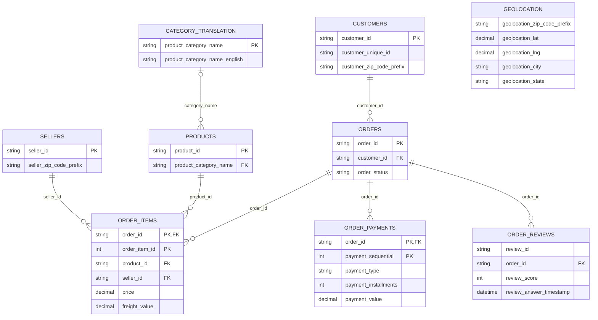

# Phase 03: Source Grain, ERD and Duplicate-Calculation Strategy

## 1. Objective and evidence

Document what one row represents in each of the nine raw Olist files, identify candidate keys and relationships, and define how analytical models will avoid multiplying financial values and counts.

This document uses the Phase 02 results shared in the project conversation. Additional key and cardinality checks below are proposed validation steps, not newly executed results. Raw source files must remain unchanged.

## 2. Grain of every source file

| Source file | What one row represents | Candidate primary key | Foreign keys / logical links |
|---|---|---|---|
| olist_customers_dataset.csv | A customer record associated with an order; not necessarily a distinct person across orders | customer_id | customer_zip_code_prefix links logically to geographic observations |
| olist_orders_dataset.csv | One order and its lifecycle/status | order_id | customer_id → customers.customer_id |
| olist_order_items_dataset.csv | One numbered item within an order | (order_id, order_item_id), subject to composite-key validation | order_id → orders; product_id → products; seller_id → sellers |
| olist_order_payments_dataset.csv | One sequential payment record within an order; not one installment per row | (order_id, payment_sequential), subject to composite-key validation | order_id → orders |
| olist_order_reviews_dataset.csv | One source review record associated with an order | No key established yet; test review_id and (order_id, review_id) before accepting either | order_id → orders |
| olist_products_dataset.csv | One product and its descriptive/physical attributes | product_id | product_category_name → category_translation, when populated and matched |
| olist_sellers_dataset.csv | One seller record | seller_id | seller_zip_code_prefix links logically to geographic observations |
| olist_geolocation_dataset.csv | One recorded geographic observation for a ZIP-code prefix | No established natural primary key | geolocation_zip_code_prefix is a grouping/linking attribute, not a unique key |
| product_category_name_translation.csv | One Portuguese category name mapped to an English category name | product_category_name | None |

### Key interpretation

- `customer_id` identifies the customer record used by an order. Use `customer_unique_id` to measure distinct customers across purchases; do not treat it as the primary key of the raw customer table.
- `order_item_id` is numbered within an order. It is not globally unique, and repeated products in an order must not be deleted merely because `product_id` repeats.
- `payment_sequential` is meaningful together with `order_id`. `payment_installments` describes the payment record; do not multiply `payment_value` by installments.
- Neither one review per order nor unique `review_id` should be assumed. Preserve source records until a documented review policy is applied.
- ZIP prefixes can have multiple observations, cities or coordinates. Removing exact duplicate rows does not make the prefix unique. Load prefixes as strings to preserve leading zeros.
- Candidate keys must be non-null and unique. A generated ingestion row identifier provides traceability but does not prove business uniqueness.

## 3. Phase 02 evidence and its limits

The shared profiling outputs identified unique single-column identifiers for customers, orders, products, sellers and category translation. Composite keys and review keys still require validation.

The shared relationship report found zero orphan rows in these six tested links:

1. Orders → customers.
2. Order items → orders.
3. Payments → orders.
4. Reviews → orders.
5. Order items → products.
6. Order items → sellers.

These results do not prove that every order has items, payments or reviews, or that relationships are one-to-one. Product-category coverage and ZIP-prefix coverage were not included in those six tests.

Geolocation had 1,000,163 rows and 261,831 exact duplicate rows in the shared summary. This is a known duplication risk.

The earlier date script selected columns containing `date`, so it omitted timestamps such as `order_purchase_timestamp`, `order_approved_at` and `review_answer_timestamp`. Its invalid-date count also included missing values. Complete date validation must distinguish missing values from non-null parsing failures. The status script listed observed statuses; it did not validate them against an allowed list.

## 4. Raw relationships and cardinality

| Parent → child | Join columns | Modeling cardinality | Duplication consideration |
|---|---|---|---|
| Customers → orders | customer_id | Each order references one customer record; test whether each customer record has at most one order in this extract | Do not assert observed one-to-one cardinality from equal row counts alone |
| Orders → order_items | order_id | One order to zero or many items | Order attributes repeat at item grain |
| Orders → order_payments | order_id | One order to zero or many payment records | Payment rows multiply item rows in a direct join |
| Orders → order_reviews | order_id | One order to zero or many review records | Reviews can multiply both item and payment rows |
| Products → order_items | product_id | One product to zero or many items | Product lookup must be unique on product_id |
| Sellers → order_items | seller_id | One seller to zero or many items | Seller lookup must be unique on seller_id |
| Category translation → products | product_category_name | One translation to zero or many products; a product may lack a matching translation | Use a left join and retain missing/unmatched categories |
| Geolocation ↔ customers | ZIP prefix | Potential many-to-many logical match in raw data | Never use raw observations as a unique ZIP lookup |
| Geolocation ↔ sellers | ZIP prefix | Potential many-to-many logical match in raw data | Aggregate/resolve geography before enrichment |

### One-to-one relationships

The customer-record-to-order relationship is a one-to-one candidate for this extract. Confirm that `orders.customer_id` is unique and check whether any customer rows are unused before describing it as exactly one-to-one. Across purchases, one `customer_unique_id` can link to multiple customer records and orders.

In the analytical layer, orders join one-to-zero-or-one to each order-level aggregate because those aggregates must have one row per `order_id`.

## 5. Source ERD specification

The following Mermaid diagram describes the raw logical relationships conservatively. PK labels on composite keys are candidates pending validation. ZIP links are listed separately because raw geography has no unique ZIP parent key.



Diagram notes:

- The customers-to-orders edge allows multiple orders conservatively until the extract's one-to-one candidate is tested.
- Geolocation is intentionally not drawn as a PK/FK parent. Its logical ZIP matches to customers and sellers can be many-to-many.
- The category relationship is optional on the product side because categories can be missing or unmatched.
- Reproduce this specification and its notes in `diagrams/source_erd.drawio`; the existing empty placeholder is not a completed ERD.

## 6. Duplicate calculation challenge

### Why one large raw join fails

Suppose one order has two items, three payment records and two review records. Joining these three child tables by `order_id` produces 2 × 3 × 2 = 12 rows.

| Metric | Correct source total | Total after an unrestricted raw join |
|---|---:|---:|
| Item prices: 100 + 50 | 150 | 900 |
| Item freight: 10 + 5 | 15 | 90 |
| Payments: 60 + 60 + 45 | 165 | 660 |
| Orders | 1 | 12 rows |
| Review records | 2 | 12 rows |

Each item is repeated six times, each payment four times, and each review six times. The example is illustrative, not an observed order.

`SUM(DISTINCT price)` is not a solution: different legitimate items can have the same price. Dropping duplicate order IDs from the joined data would discard legitimate items and payments.

## 7. Metric definitions and prevention rules

| Metric | Definition and grain | Safe calculation |
|---|---|---|
| Merchandise sales / analytical revenue | Sum of item price for an explicitly defined order-status population; excludes freight | Sum price at item grain, or sum precomputed item totals at order grain |
| Order count | Number of orders in the defined population | Count orders from a unique order table; use distinct order_id only when counting within a child table |
| Payment value | Sum of payment_value across source payment records | Aggregate payments by order_id before joining other child aggregates |
| Freight | Sum of freight_value across item rows | Aggregate items by order_id; retain item grain for seller/product analysis |
| Review count | Number of retained source review records under the stated review policy | Count in the review table or sum order-level review counts |
| Reviewed orders | Orders with at least one retained review | Count unique order_id in reviews, or count review_count > 0 after an order-level join |
| Review score | Explicitly choose review-weighted or order-weighted average | Review-weighted: total score sum / total valid score count; order-weighted: average one defined score per order |

Use all orders for operational status analysis. A delivered-only sales metric may be used if labeled and filtered consistently. Item sales are an analytical proxy, not audited accounting revenue; the available source fields do not establish complete refunds, fees or accounting recognition.

Do not add payments to merchandise sales: they measure different aspects of the same purchase. Reconcile payment totals against item price plus freight using a documented currency tolerance, and investigate differences rather than forcing equality.

## 8. Modeling strategy

Keep separate tables at their natural grains:

- Orders: one row per order.
- Order items: one row per order/item key.
- Payments: one row per order/payment sequence key.
- Reviews: one row per retained review source record with ingestion traceability.
- Customer, product, seller and category lookups: unique validated keys.
- Prepared ZIP lookup: one row per ZIP prefix after a documented geography-resolution policy.

For an order-level overview:

1. Aggregate items by order_id: item count, merchandise total and freight total.
2. Aggregate payments by order_id: payment record count and payment total.
3. Aggregate reviews by order_id: review record count, score sum and valid-score count.
4. Left join each aggregate to orders and enforce one-to-one merge validation.
5. Join validated customer attributes using a many-to-one validation.
6. Confirm the result still has exactly one row per order and unchanged metric totals for the same population.

Retain missing aggregate values and presence flags so an absent child record is distinguishable from a recorded zero. Fill display values with zero only under an explicit reporting rule.

### Product and seller reporting

Use item-grain sales and freight with validated product and seller lookups. Do not repeat full order payment totals across products or sellers. If payment allocation is required, implement a separately labeled allocation rule, define its zero-denominator behavior and verify that allocated amounts sum back to the original order payment.

Orders containing several categories can count once in each category. Those category-level distinct order counts are not additive to the overall order count. The same caution applies to order reviews attributed to several products or sellers.

### Review policy

Preserve raw reviews. For a review-weighted score, use all retained valid score records and count their denominator explicitly. If one score per order is required, create a separate derived table using a stated selection policy, such as the latest answer timestamp, with a deterministic tie-breaker and an explicit rule for missing timestamps. Do not silently discard extra reviews.

### Geography policy

Prepare a separate one-row-per-prefix lookup. A candidate approach is median coordinates plus a deterministic city/state resolution rule, with ambiguity flags. Validate coordinate ranges and geographic consistency first. Missing ZIP matches must not remove orders, customers or sellers.

## 9. Validation required before closing Phase 03

| Check | Acceptance / handling rule |
|---|---|
| Proposed single-column keys | No null values or duplicate keys |
| Item composite key | Validate (order_id, order_item_id); investigate duplicates |
| Payment composite key | Validate (order_id, payment_sequential); investigate duplicates |
| Review key | Test review_id and (order_id, review_id); document actual duplicate patterns |
| Customer/order cardinality | Check repeated orders.customer_id and unused customer records |
| Child coverage | Count orders with zero items, payments or reviews; examine by order_status |
| Category coverage | Separate missing product categories from non-null unmatched categories |
| Geography coverage | Count missing/unmatched prefixes; validate uniqueness only in the prepared lookup |
| Safe joins | Enforce many-to-one or one-to-one joins as appropriate |
| Order overview | Row count and distinct order count match the selected orders population |
| Metric conservation | Sales, freight, payments and review counts reconcile before/after joins for the same population |
| Review-score range | Validate non-null scores against the permitted 1–5 range |

## 10. Deliverables and completion status

| Deliverable | Location | Status at document creation |
|---|---|---|
| Grain, keys, relationship notes and duplicate strategy | documentation/phase_03_grain_erd_duplicates.md | Document prepared |
| ERD specification | Section 5 of this document | Included |
| Standalone visual ERD | diagrams/source_erd.drawio | Placeholder exists; populate and review next |
| Additional key/cardinality validation | profiling/ and supporting Python script | Pending execution |
| Phase 03 commit and push | Project Git repository | Pending |

Do not mark Phase 03 complete until the validation results are documented and the standalone ERD is populated and reviewed.

## 11. Close the phase

After validation and the ERD are complete, run from the project root:

```powershell
git status
git add documentation/phase_03_grain_erd_duplicates.md diagrams/source_erd.drawio
# Also stage the exact Phase 03 validation script/report paths once created.
git commit -m "Phase 03: source grain, ERD and duplicate-calculation strategy"
git push
```

## 12. Explanation for the supervisor

Each raw file is modeled according to what one row represents. Orders, items, payments and reviews have different grains, so joining all raw child rows creates multiplication. We preserve their natural grains and aggregate child measures to one row per order before combining order-level results. Validated lookup keys, explicit review and geography rules, and reconciliation checks keep sales, freight, payments and counts consistent.

## 13. Executed Phase 03 Validation Results

This section supersedes the earlier provisional key and cardinality notes.

### Validated Keys

All tested candidate keys have zero null values.

| Table | Validated key |
|---|---|
| customers | customer_id |
| orders | order_id |
| products | product_id |
| sellers | seller_id |
| category_translation | product_category_name |
| order_items | order_id + order_item_id |
| order_payments | order_id + payment_sequential |
| order_reviews | order_id + review_id |

review_id alone is not unique: 1,603 rows belong to duplicate
review_id groups. These are not necessarily exact duplicate rows.
The composite (order_id, review_id) is unique in this extract.

### Customer-to-Order Relationship

No customer_id is associated with multiple orders, and no customer
records are unused. Combined with the previously validated foreign
key coverage, this confirms a one-to-one relationship between raw
customer records and orders in this extract.

There are 96,096 distinct customer_unique_id values. Use this field
for distinct customers across purchases.

### Child-Table Multiplicity and Coverage

| Child table | Orders with multiple records | Orders without records |
|---|---:|---:|
| order_items | 9,803 | 775 |
| order_payments | 2,961 | 1 |
| order_reviews | 547 | 768 |

The order missing payment records has delivered status.
Of the orders missing reviews, 646 have delivered status.

Preserve these orders using left joins. Missing payment records
must not automatically be interpreted as zero-value payments.
Review averages must exclude absent reviews rather than treating
them as zero scores.

### Category and Geography Coverage

- 610 products have missing categories.
- 13 products have non-null categories absent from the translation table.
- Geolocation contains 261,831 exact duplicate rows.
- 17,972 ZIP prefixes have multiple geolocation observations.
- 278 customer rows have non-null unmatched ZIP prefixes.
- 7 seller rows have non-null unmatched ZIP prefixes.

Keep missing and unmatched categories distinguishable.
Use left joins for enrichment and resolve geography to a unique
ZIP-prefix lookup before joining it to customers or sellers.

### Review Scores

No missing or invalid review scores were found.
All scores are integers within the permitted range of 1–5.

### Validation Outputs

- profiling/phase_03_key_validation.csv
- profiling/phase_03_relationship_validation.csv
- profiling/phase_03_missing_children_by_status.csv

### Remaining Work

- Render and inspect the updated ERD.
- Demonstrate that order-level aggregation preserves financial totals
  and review counts.
- Update earlier provisional sections to match these results.
- Commit and push Phase 03 after verification.
## 14. Safe-Join Verification Results

Child tables were aggregated to one row per order before joining
to orders. All joins enforced one-to-one cardinality.

| Metric | Before join | After join | Result |
|---|---:|---:|---|
| Orders | 99,441 | 99,441 | PASS |
| Distinct orders | 99,441 | 99,441 | PASS |
| Item records | 112,650 | 112,650 | PASS |
| Merchandise sales (cents) | 1,359,164,370 | 1,359,164,370 | PASS |
| Freight (cents) | 225,190,954 | 225,190,954 | PASS |
| Payment records | 103,886 | 103,886 | PASS |
| Payment value (cents) | 1,600,887,212 | 1,600,887,212 | PASS |
| Review records | 99,224 | 99,224 | PASS |
| Review score sum | 405,471 | 405,471 | PASS |
| Valid review score count | 99,224 | 99,224 | PASS |
| Reviewed orders | 98,673 | 98,673 | PASS |

Population: all source orders, regardless of status.
Financial comparisons used exact integer cents.
Missing child records remained distinguishable from recorded zeros.

These checks prove that the joins preserve source measures.
They do not establish that payment totals equal merchandise plus
freight, or that source sales represent audited accounting revenue.

Validation script: python/phase_03_verify_safe_joins.py
Validation report: profiling/phase_03_safe_join_validation.csv

## 14. Safe-Join Verification Results

Child tables were aggregated to one row per order before joining
to orders. All joins enforced one-to-one cardinality.

| Metric | Before join | After join | Result |
|---|---:|---:|---|
| Orders | 99,441 | 99,441 | PASS |
| Distinct orders | 99,441 | 99,441 | PASS |
| Item records | 112,650 | 112,650 | PASS |
| Merchandise sales (cents) | 1,359,164,370 | 1,359,164,370 | PASS |
| Freight (cents) | 225,190,954 | 225,190,954 | PASS |
| Payment records | 103,886 | 103,886 | PASS |
| Payment value (cents) | 1,600,887,212 | 1,600,887,212 | PASS |
| Review records | 99,224 | 99,224 | PASS |
| Review score sum | 405,471 | 405,471 | PASS |
| Valid review score count | 99,224 | 99,224 | PASS |
| Reviewed orders | 98,673 | 98,673 | PASS |

Population: all source orders, regardless of status.
Financial comparisons used exact integer cents.
Missing child records remained distinguishable from recorded zeros.

These checks prove that the joins preserve source measures.
They do not establish that payment totals equal merchandise plus
freight, or that source sales represent audited accounting revenue.

Validation script: python/phase_03_verify_safe_joins.py
Validation report: profiling/phase_03_safe_join_validation.csv

